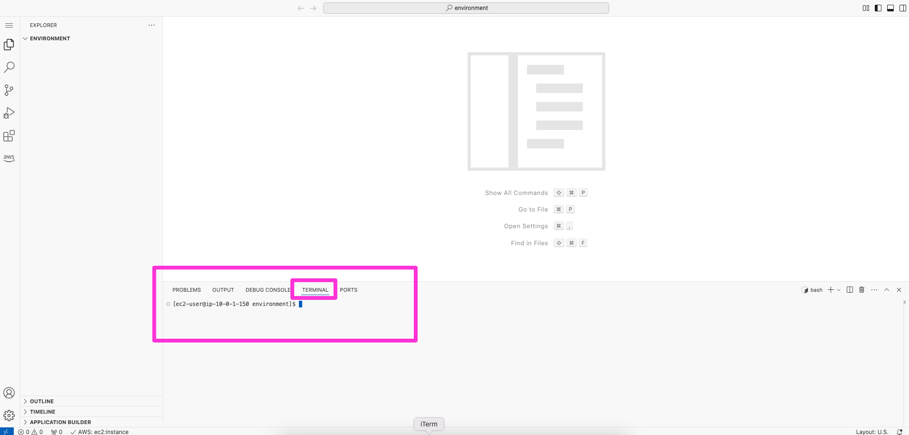

ラボを起動します。

## ラボ1環境で vscode server に接続しましょう

1. ラボ手順の左側にあるパネルから、**LabWorkspaceURL URL** の値をコピーし、新しいブラウザタブに貼り付けます。
1. パスワードの入力を求めるページが表示されます。

1. 手順の左側にあるパネルから **LabWorkspacePassword** の値をコピーし、Password フィールドに貼り付けてログインします。 
1. Visual Studio Code IDE が表示されます。terminalでコマンドを入力できます。


## AWSCLIでAWSサービスを操作してみましょう。

1. S3バケット一覧を表示するCLIコマンドを実行してみましょう。
```
aws s3 ls
```

## AWSSDKでAWSサービスを操作してみましょう。

1. サンプルコードを取得します。
```
git clone https://github.com/shotagtag/dev_on_aws
cd dev_on_aws/mod3/01-try-it-out-awstools/
```

2. サンプルコードを確認します。
```
cat helloaws.py
```

3. サンプルコードを実行します。
```
python3 helloaws.py
```

